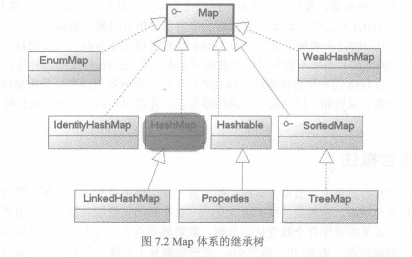

## 顶级接口：
   * Collection
       
   * Map
       

## 顶级类：
   * Collections
   
   
### 接口描述
   * Collection ：  不提供直接子类继承，只提供继承的子接口（List和Set）
      * List : 有序的Collection，控制元素的插入位置，和通过索引访问List数据，允许相同的Key。
        * Verctor
            * Stack
        * ArrayList
        * LinkedList( 也继承自 Deque)
        
        * [ArrayList和LinkedList对比](https://earyant.github.io/2017/09/10/ArrayList%E5%92%8CLinkedList%E5%AF%B9%E6%AF%94/)
    
      * Set ： 不保存重复数据
        * HashSet
            * LinkedHashSet
        * SortedSet
            * TreeSet
        * EnumSet
      * Queue
        * DeQue
            * LinkedList
        * PriorityQueue
   * Map
        * EnumMap
        * HashMap
            * LinkedHashMap
        * IdentityMap
        * HashTable
            * Properties
        * SortedMap
            * TreeMap
        * WeakHashMap
        
