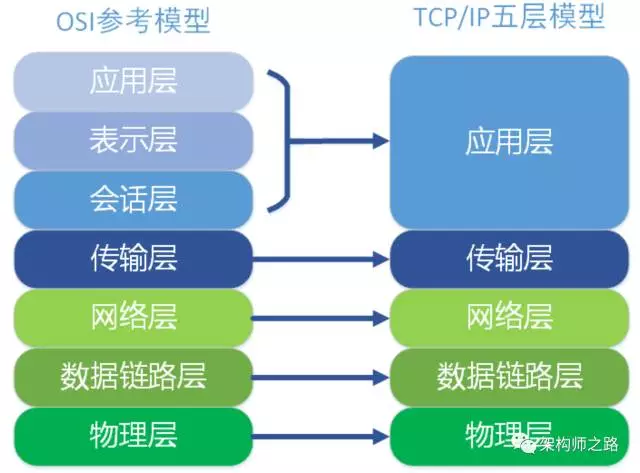

# 代理分类
  ## 正向代理
    >服务器ip地址不变，用户ip地址变。例如用户(1.1.1.1)使用正向代理(2.2.2.2)访问服务器(3.3.3.3),那么服务器收到的消息来自2.2.2.2.服务器不知道用户真正的地址。
    
  ## 反向代理
    > 反之，用户不知道服务器的地址。
    
   ### 场景
    对用户屏蔽高可用、屏蔽web-server扩展、内网等一些细节。
    由于web-server有多台，需要进行负载均衡。
    
# [负载均衡]{}
## 软件
   * nginx/apache
   * F5
   * lvs
   
## 什么是四层（转发/交换），什么是七层（转发/交换）？
    
   由图可见，4层指传输层，7层指应用层
   更具体的，对应到nginx反向代理hash：
   * 四层：根据用户ip+port来做hash
   * 七层：根据http协议中的某些属性来做hash
   
## 为什么中间少了几层？
    OSI应用层、表示层、会话层合并到TCP/IP的应用层啦。

##  上面有四层，七层，那有没有二层，三层呢？
   * 二层：根据数据链路层MAC地址完成数据交换
   * 三层：根据网络层IP地址完成数据交换   