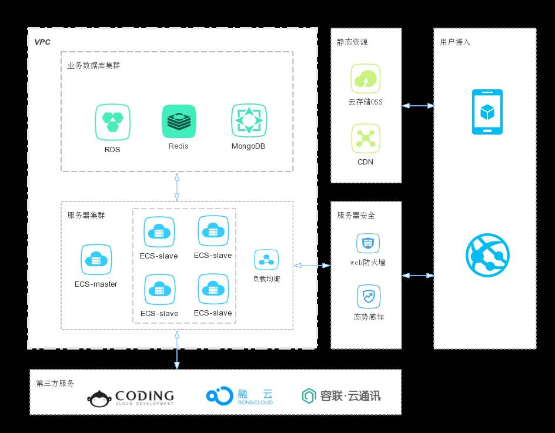

  * wechatParent:    
    * wechat-base-parent
    * wechat-business-parent
    * wechat-core-parent
    * wechat-web-parent
    
    
    
### wechatParent
   * 职责： 一键构建所有需要发布的项目。
   * 特性
        * 所有项目初始时就带有这些 jar 包的依赖，例如：testng(单元测试相关),h2(单元测试相关),easymock(单元测试相关),lombok（根据注释自动生成 setter 和 getter）
        * 所有项目的额外特性，例如：单元测试插件
        * 项目发布管理，例如：私一的 maven 私服配置

### wechat-core-parent
   * 职责：
        * 该部分与业务没有关联，只提供基础能力。例如：数据库持久能力，缓存能力，http封装能力，通用工具能力。
   * 通用特性：
        * javadoc插件，用于生成javadoc
        
### wechat-base-parent
   * 只代表一个真实存在而且能独立存在的业务实体，简称base项目。
   
   
### we-business-parent
   * 职责：
        * 它所聚合的的项目必须是一个提供 “共享” 业务流程，简称：business 项目。在这个流程过程中有可能需要引用 base 服务。它本身没有一个真实存在而且能独立存在的核心实体       
        
### wechat-web-parent    
   * 职责：
        * 它所聚合的的项目可以通过互联网向用户提供服务，在产品规划上它自己独有的不被共享的业务，简称：web 项目。
  
  
  
### 总体架构图如下
     
   
   
   
### Redis
   * 提到阿里云的这个 Redis，不得不吐槽一句，它竟然是不支持主从的，只能单实例，不过，用它做数据缓存，还真是蛮不错的选择，响应速度非常快。而且，因为是放置在内网的且只能内网访问，所以安全性也很高。
### MongoDB
   * 结构型数据，主要存储档案式的数据，比如每个用户的操作行为，以档案式记录并进行统计分析，方便下一阶段的项目做个性化服务。另外一些关联复杂的数据，也可以用 MongoDb 存储，可以提高访问速度。还有，一些对软件应用版本比较敏感的数据也可以存在 MongoDB 中，比如 a 版本拿到 A 数据，b 版本拿到 B 数据，而这个 AB 数据都是由很多关联关系复杂的数据所组成，如果把这些数据根据版本号存储在不同的 MongoDB 档案中，需要时，直接根据版本号拿就可以了，这样就避免了很多的 mysql 查询。
   
### 静态资源

   * OSS + CDN
OSS 存储静态资源，CDN(内容分发网络) 可以加速静态资源的下载速度。至于资源链接地址，客户端可以通过接口访问从后端业务数据库中拿到。   