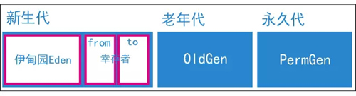

http://zhuanlan.51cto.com/art/201709/550451.htm

## JVM内存模型
   
   
   打印出来的信息：
    
    PSYoungGen      total 3072K, used 128K 
        eden space 2560K, 5% used  
        survivor  space 
            from space 512K, 0% used  
             to   space 512K, 0% used  
     
    ParOldGen       total 6656K, used 408K 
        object space 6656K, 6% used   
     
    PSPermGen       total 4096K, used 3039K    
        object space 4096K, 74% used  
        
## GC过程
   * 年轻代：
       存放对象的特点： 生命周期短，多为临时变量。
       > 新实例化的对象都会在eden中new出来，经过手动System.gc()（本质上也是调用Runtime的gc）、Runtime.getRuntime().gc()（本地方法）或者一段时间后系统自动触发gc，年轻代使用 *复制清除*算法 ，从Root对象开始标记为存活，存活的对象引用的对象也会标记为存活，扫描整个eden区后，将存活的对象存放到其中一个survivor区，清除eden区和另外一个eden区。下次再产生新的对象仍然是放到eden区内，再gc时将eden区和有对象存储的survivor存活的对象复制到另外一个survivor区内，清除这两个区，反复如此，清除一定次数后（之前看过介绍15次，不太确定）将仍然存活的放到年老代。
   * 年老代
       存放对象特点： 生命周期长。
       > 年老代使用*标记整理*算法，还是从Root对象开始搜索，标记所有存活的对象，把所有存活的对象复制到一个区域内，再清除其他区域。
       
## 示例
  ### 栈内存溢出(java.lang.StackOverflowError)
     > -Xmx10m
       -XX:MaxPermSize=5m
       -XX:MaxDirectMemorySize=5m
       -XX:+PrintGCDetails
  ### 永久代溢出(java.lang.OutOfMemoryError: GC overhead limit exceeded)